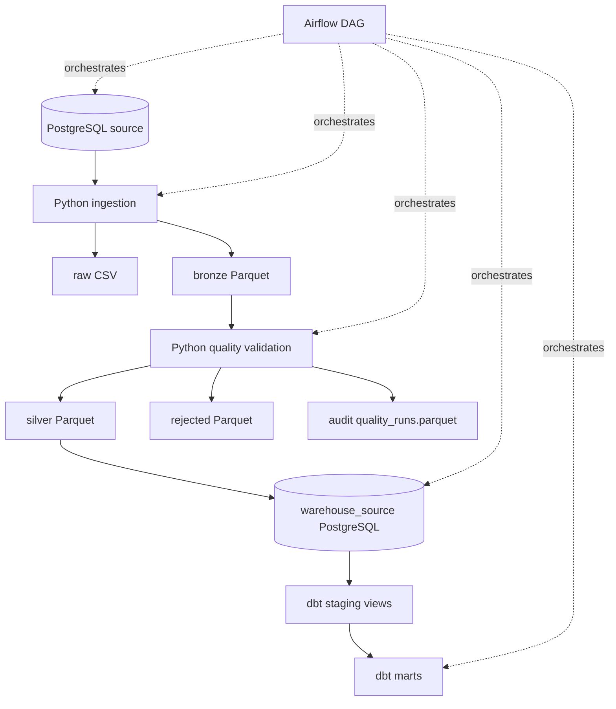

# Architecture / Arquitectura

## ES — Objetivo de la arquitectura

RetailPulse implementa una plataforma batch local para un e-commerce sintético. La arquitectura separa fuente operacional, ingesta, almacenamiento por capas, calidad, carga a warehouse, modelado analítico y orquestación.

El objetivo es que el flujo sea reproducible, observable y fácil de explicar sin convertir el proyecto en una plataforma productiva sobredimensionada.

## ES — Flujo general



Versión textual:

```text
PostgreSQL source -> Python ingestion
  ├── raw CSV
  └── bronze Parquet -> quality validation
                         ├── silver -> warehouse_source -> dbt staging -> dbt marts
                         ├── rejected
                         └── audit

Airflow: orchestration of existing steps
Dashboard: outside v1.0
```

## ES — Componentes principales

### 1. Fuente PostgreSQL

PostgreSQL simula el sistema operacional del e-commerce.

Tablas fuente:

- `customers`
- `products`
- `inventory`
- `orders`
- `order_items`
- `payments`

La fuente es sintética, pero mantiene relaciones y restricciones para representar un sistema transaccional controlado.

### 2. Ingesta Python

Python extrae las tablas fuente desde PostgreSQL y escribe snapshots locales.

Raw y bronze se escriben desde el mismo DataFrame extraído; bronze no se construye releyendo el CSV raw. Las flechas discontinuas del diagrama representan coordinación de Airflow, no transferencia de datos.

Responsabilidades:

- conectarse a PostgreSQL.
- extraer tablas fuente.
- escribir raw y bronze.
- añadir metadatos de ingesta.
- exponer comandos CLI reproducibles.

### 3. Raw

`raw` guarda snapshots CSV sin transformar.

Su objetivo es conservar una copia simple e inspeccionable de lo extraído. No es la capa analítica principal.

### 4. Bronze

`bronze` guarda Parquet con metadatos técnicos:

- `ingestion_id`
- `ingested_at`
- `source_system`
- `source_table`

Bronze todavía no se considera dato aprobado para analítica.

### 5. Validación de calidad

La validación lee bronze, aplica reglas deterministas y separa registros válidos e inválidos.

Comprueba completitud, unicidad, dominios permitidos, importes y claves foráneas simples.

### 6. Silver

`silver` contiene solo registros que superan las reglas de calidad.

Es la única entrada del warehouse analítico en v1.0.

### 7. Rejected

`rejected` conserva registros inválidos con `rejection_reason`.

No alimenta marts porque podría contaminar métricas de negocio. Su uso es diagnóstico, auditoría y posible reproceso.

### 8. Audit

`data/audit/quality_runs.parquet` resume cada validación con conteos de entrada, válidos, rechazados y estado por tabla.

### 9. Warehouse source

`warehouse_source` expone en PostgreSQL las seis tablas silver para dbt.

La carga es full refresh / replace en v1.0.

### 10. dbt staging

Los modelos `stg_*` seleccionan columnas explícitas, castean tipos y conservan metadatos. No hacen joins ni agregaciones.

### 11. dbt marts

Los marts iniciales son:

- `dim_customer`
- `dim_product`
- `dim_date`
- `fact_sales`
- `fact_inventory`

`fact_sales` tiene grano de línea de pedido. `fact_inventory` tiene grano de producto.

### 12. Airflow

Airflow orquesta el flujo completo con un DAG manual local. No contiene lógica de transformación ni reglas de negocio.

## ES — Por qué rejected no entra al warehouse analítico

El warehouse debe modelar datos aprobados. Los registros rechazados pueden contener emails inválidos, precios negativos, estados desconocidos, claves foráneas rotas o totales inconsistentes.

Por eso el flujo es:

```text
silver   -> warehouse_source -> dbt -> marts
rejected -> diagnóstico / auditoría / posible reproceso
```

## ES — Fuera de v1.0

No forman parte de v1.0:

- dashboard.
- incrementalidad.
- Spark.
- Kafka.
- MongoDB.
- ML.
- GenAI.
- despliegue productivo.
- alertas externas.
- SCD.
- capa semántica de métricas.

---

## EN — Architecture objective

RetailPulse implements a local batch platform for a synthetic e-commerce business. The architecture separates operational source, ingestion, layered storage, quality, warehouse loading, analytical modeling and orchestration.

The goal is to keep the flow reproducible, observable and easy to explain without turning the project into an overbuilt production platform.

## EN — General flow


Text version:

```text
PostgreSQL source -> Python ingestion
  ├── raw CSV
  └── bronze Parquet -> quality validation
                         ├── silver -> warehouse_source -> dbt staging -> dbt marts
                         ├── rejected
                         └── audit

Airflow: orchestration of existing steps
Dashboard: outside v1.0
```

## EN — Main components

### 1. PostgreSQL source

PostgreSQL simulates the e-commerce operational system.

Source tables:

- `customers`
- `products`
- `inventory`
- `orders`
- `order_items`
- `payments`

The source is synthetic, but it keeps relationships and constraints to represent a controlled transactional system.

### 2. Python ingestion

Python extracts source tables from PostgreSQL and writes local snapshots.

Raw and bronze are written from the same extracted DataFrame; bronze is not built by rereading the raw CSV. Dashed arrows represent Airflow coordination, not data transfer.

Responsibilities:

- connect to PostgreSQL.
- extract source tables.
- write raw and bronze.
- add ingestion metadata.
- expose reproducible CLI commands.

### 3. Raw

`raw` stores untransformed CSV snapshots.

Its purpose is to keep a simple inspectable copy of what was extracted. It is not the main analytical layer.

### 4. Bronze

`bronze` stores Parquet files with technical metadata:

- `ingestion_id`
- `ingested_at`
- `source_system`
- `source_table`

Bronze is still not trusted for analytics.

### 5. Quality validation

Quality validation reads bronze, applies deterministic rules and separates valid and invalid records.

It checks completeness, uniqueness, accepted domains, amounts and simple foreign keys.

### 6. Silver

`silver` contains only records that passed all quality checks.

It is the only input to the analytical warehouse in v1.0.

### 7. Rejected

`rejected` keeps invalid records with `rejection_reason`.

It does not feed marts because it could contaminate business metrics. Its purpose is diagnosis, audit and possible reprocessing.

### 8. Audit

`data/audit/quality_runs.parquet` summarizes each validation with input, valid, rejected and status counts by table.

### 9. Warehouse source

`warehouse_source` exposes the six silver tables in PostgreSQL for dbt.

The v1.0 load uses full refresh / replace.

### 10. dbt staging

`stg_*` models select explicit columns, cast types and preserve metadata. They do not join or aggregate.

### 11. dbt marts

Initial marts:

- `dim_customer`
- `dim_product`
- `dim_date`
- `fact_sales`
- `fact_inventory`

`fact_sales` is at order-item grain. `fact_inventory` is at product grain.

### 12. Airflow

Airflow orchestrates the full flow with a local manual DAG. It does not contain transformation logic or business rules.

## EN — Why rejected does not enter the analytical warehouse

The warehouse should model approved data. Rejected records can contain invalid emails, negative prices, unknown statuses, broken foreign keys or inconsistent totals.

Therefore, the flow is:

```text
silver   -> warehouse_source -> dbt -> marts
rejected -> diagnosis / audit / possible reprocessing
```

## EN — Outside v1.0

The following are outside v1.0:

- dashboard.
- incremental loading.
- Spark.
- Kafka.
- MongoDB.
- ML.
- GenAI.
- production deployment.
- external alerts.
- SCD.
- semantic metrics layer.
