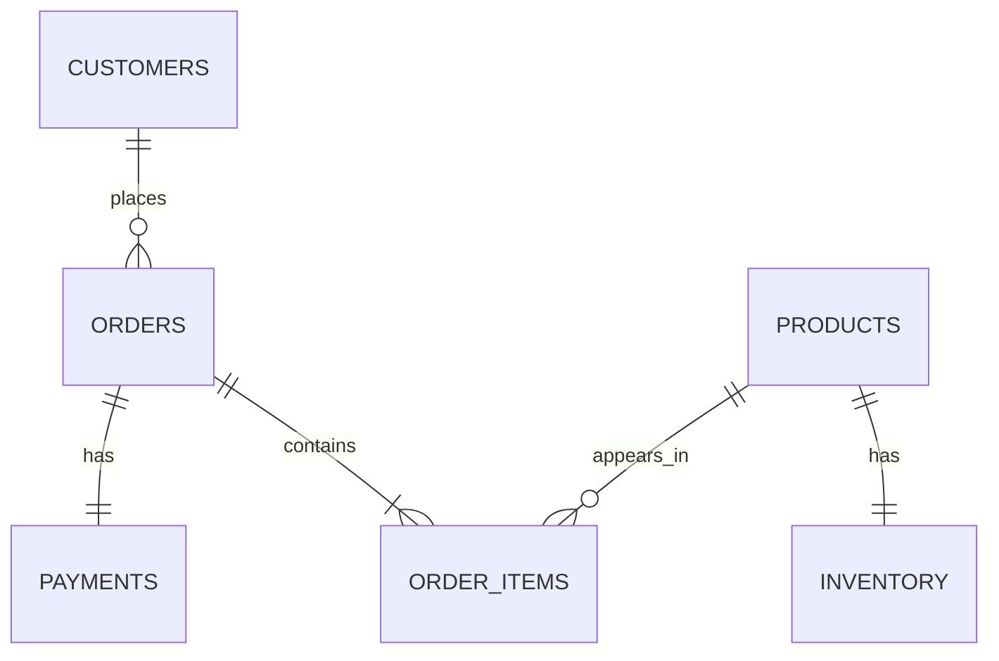

# Modelo fuente de RetailPulse

## Propósito

Este modelo representa el sistema operacional mínimo de un e-commerce. Es la fuente de PostgreSQL de la Fase 1 y todavía no constituye un warehouse ni un data lake.

## Tablas

| Tabla | Propósito | Clave primaria | Claves foráneas |
|---|---|---|---|
| `customers` | Clientes, localización y segmento sintético | `customer_id` | — |
| `products` | Catálogo, SKU y precio vigente | `product_id` | — |
| `inventory` | Existencias y umbral de reposición | `product_id` | `product_id → products.product_id` |
| `orders` | Cabecera, fecha y estado del pedido | `order_id` | `customer_id → customers.customer_id` |
| `order_items` | Productos, cantidades y precio vendido | `order_item_id` | `order_id → orders.order_id`; `product_id → products.product_id` |
| `payments` | Pago y estado asociado al pedido | `payment_id` | `order_id → orders.order_id` |

## Relaciones

## Decisiones

- Las relaciones usan exclusivamente IDs técnicos: `customer_id`, `product_id`, `order_id`, `order_item_id` y `payment_id`. `first_name`, `last_name` y `email` son atributos descriptivos de cliente; no actúan como claves de relación.
- `product_id` es la clave primaria interna y estable. `sku` es un identificador comercial único con formato `CATEGORIA-PRODUCTO-NUMERO`; puede ser comunicado o cambiado por reglas de negocio sin alterar las relaciones técnicas.
- `product_name` es un atributo descriptivo, no una clave de relación, y no necesita ser único. El catálogo combina productos base con variantes naturales y permite nombres parecidos.
- Cada producto tiene exactamente un registro de inventario.
- Cada pedido contiene entre uno y tres productos distintos.
- Cada pedido tiene un único pago y `payment_amount` coincide con la suma de sus líneas.
- Los estados y métodos de pago están restringidos tanto en Python como en PostgreSQL.
- Una seed maestra genera secuencias aleatorias hijas para cada entidad. Repetir volúmenes y seed reproduce el mismo dataset.
- `seed-db` reemplaza el contenido de las tablas fuente en una transacción para evitar duplicados en reejecuciones.

## Patrones de cliente para RFM

`synthetic_behavior_segment` es una etiqueta técnica creada exclusivamente por el generador para introducir diferencias de recencia, frecuencia y valor antes de disponer de comportamiento real:

- `high_value`: menor frecuencia y selección de productos de mayor precio y cantidad.
- `frequent`: mayor probabilidad de compra y ticket medio.
- `occasional`: menor frecuencia y cestas pequeñas.
- `inactive`: pedidos antiguos y baja probabilidad de compra.
- `new`: altas y pedidos recientes.

La columna guía la simulación y no representa una clasificación observada del negocio. **No debe utilizarse como feature ni como entrada de un modelo RFM o K-means**: hacerlo introduciría la respuesta sintética en el análisis y produciría fuga de información.

Si se conserva en un warehouse futuro, debe tratarse únicamente como metadato de auditoría o variable de validación sintética. Debe excluirse de dimensiones de negocio, métricas RFM, datasets de entrenamiento y features analíticas.

## Limitaciones

- Los nombres, ubicaciones y productos proceden de catálogos pequeños y controlados.
- Los segmentos y sus ponderaciones son supuestos artificiales, no etiquetas observadas ni resultados de un modelo.
- No se modelan promociones, impuestos, costes de envío, devoluciones parciales ni variaciones de precio históricas.
- No se simulan cambios de inventario causados por cada pedido.
- El dataset es reproducible y útil para desarrollo, pero no representa distribución comercial real.
