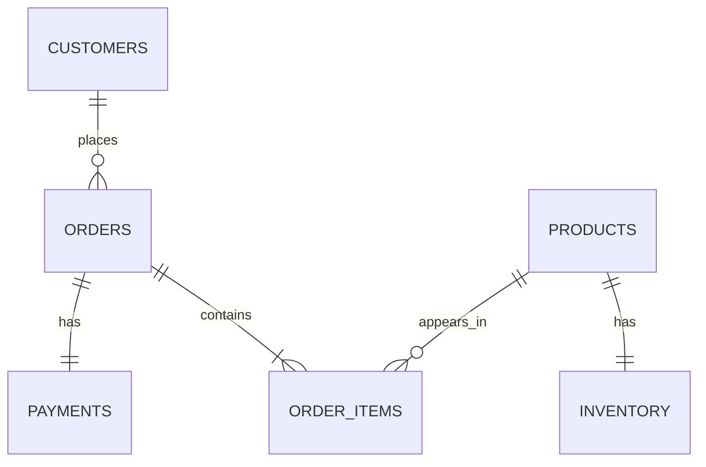

# Source Model / Modelo Fuente

## ES — Propósito

Este documento describe el modelo operacional fuente de RetailPulse. Representa un e-commerce mínimo en PostgreSQL y sirve como punto de partida del pipeline.

No es un warehouse ni un modelo analítico. Es una fuente transaccional simulada para practicar ingesta, validación, carga y modelado posterior.

## ES — Tablas fuente

| Tabla | Propósito | Clave primaria | Claves foráneas |
|---|---|---|---|
| `customers` | Clientes, localización y segmento sintético | `customer_id` | — |
| `products` | Catálogo, SKU y precio vigente | `product_id` | — |
| `inventory` | Stock y umbral de reposición | `product_id` | `product_id → products.product_id` |
| `orders` | Cabecera, fecha y estado del pedido | `order_id` | `customer_id → customers.customer_id` |
| `order_items` | Productos comprados, cantidades y precio vendido | `order_item_id` | `order_id → orders.order_id`; `product_id → products.product_id` |
| `payments` | Pago y estado asociado al pedido | `payment_id` | `order_id → orders.order_id` |

## ES — Relaciones

## ES — Decisiones de diseño

- Las relaciones usan IDs técnicos: `customer_id`, `product_id`, `order_id`, `order_item_id` y `payment_id`.
- `email`, `first_name`, `last_name`, `sku` y `product_name` son atributos descriptivos o comerciales, no claves relacionales principales.
- `product_id` es la clave interna estable.
- `sku` es el identificador comercial del producto y es único.
- La variante del nombre modifica el precio base con un multiplicador sencillo; las variantes premium tienden a ser más caras y las básicas o compactas, más baratas.
- El 20 % de los productos forma el catálogo inicial; el resto se incorpora durante el periodo simulado.
- Cada producto tiene un único registro de inventario.
- Cada pedido contiene una o varias líneas en `order_items`.
- Una línea solo puede seleccionar productos dados de alta en la fecha del pedido.
- Cada pedido tiene un único pago en `payments`.
- Los estados de pedido y pago están restringidos por dominios controlados.
- El generador usa una seed para que los datasets sean reproducibles.
- `seed-db` reemplaza el contenido de las tablas fuente para evitar duplicados en reejecuciones.

## ES — Segmento sintético de comportamiento

`synthetic_behavior_segment` es una etiqueta creada por el generador para simular patrones de recencia, frecuencia y valor.

Valores:

- `high_value`
- `frequent`
- `occasional`
- `inactive`
- `new`

Esta columna no representa un segmento real de negocio. No debe interpretarse como resultado analítico ni utilizarse como target de ML.

En v1.0 puede conservarse como metadato auxiliar para explicar cómo se generaron los datos sintéticos.

## ES — Limitaciones

- Los datos son sintéticos y no representan una distribución comercial real.
- Los catálogos de productos, países y ciudades son controlados.
- No se modelan promociones, impuestos, envíos ni devoluciones parciales.
- No hay histórico de cambios de precio.
- No se simulan movimientos de inventario por cada pedido.
- El objetivo es crear una fuente reproducible para el pipeline, no una simulación completa de un ERP.

---

## EN — Purpose

This document describes the RetailPulse operational source model. It represents a minimal e-commerce system in PostgreSQL and acts as the starting point of the pipeline.

It is not a warehouse or analytical model. It is a simulated transactional source used to practice ingestion, validation, loading and later modeling.

## EN — Source tables

| Table | Purpose | Primary key | Foreign keys |
|---|---|---|---|
| `customers` | Customers, location and synthetic segment | `customer_id` | — |
| `products` | Catalog, SKU and current price | `product_id` | — |
| `inventory` | Stock and reorder threshold | `product_id` | `product_id → products.product_id` |
| `orders` | Order header, date and status | `order_id` | `customer_id → customers.customer_id` |
| `order_items` | Purchased products, quantities and sold price | `order_item_id` | `order_id → orders.order_id`; `product_id → products.product_id` |
| `payments` | Payment and order payment status | `payment_id` | `order_id → orders.order_id` |

## EN — Relationships

## EN — Design decisions

- Relationships use technical IDs: `customer_id`, `product_id`, `order_id`, `order_item_id` and `payment_id`.
- `email`, `first_name`, `last_name`, `sku` and `product_name` are descriptive or commercial attributes, not primary relational keys.
- `product_id` is the stable internal key.
- `sku` is the commercial product identifier and is unique.
- The name variant adjusts the base price with a simple multiplier; premium variants tend to cost more, while basic or compact variants tend to cost less.
- Twenty percent of products form the initial catalogue; the rest are introduced during the simulated period.
- Each product has one inventory record.
- Each order contains one or more rows in `order_items`.
- An order item can only select products created by the order date.
- Each order has one payment in `payments`.
- Order and payment statuses are restricted to controlled domains.
- The generator uses a seed to make datasets reproducible.
- `seed-db` replaces source table contents to avoid duplicates on reruns.

## EN — Synthetic behavior segment

`synthetic_behavior_segment` is a generator label used to simulate recency, frequency and value patterns.

Values:

- `high_value`
- `frequent`
- `occasional`
- `inactive`
- `new`

This column is not a real business segment. It should not be interpreted as an analytical result or used as an ML target.

In v1.0 it can be kept as an auxiliary metadata field to explain how synthetic data was generated.

## EN — Limitations

- The data is synthetic and does not represent a real commercial distribution.
- Product, country and city catalogs are controlled.
- Promotions, taxes, shipping and partial returns are not modeled.
- There is no historical price-change model.
- Inventory movements caused by each order are not simulated.
- The goal is to create a reproducible pipeline source, not a full ERP simulation.
